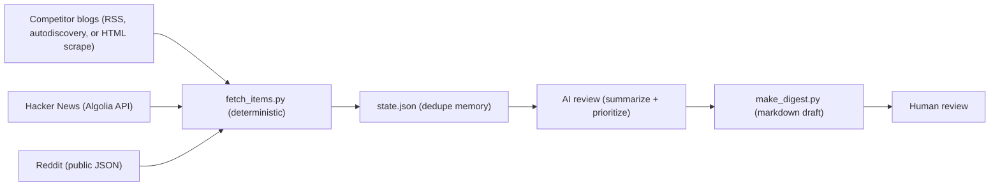

# Signadot Competitive Intelligence Agent

A competitive and brand intelligence agent, built as a working demo of agent-based marketing ops for [Signadot](https://www.signadot.com). It reads the category so the growth team doesn't have to.

## What it does

Once a week, a script checks the blogs of six competitors (Telepresence, mirrord, Okteto, vcluster, Qovery, Release) and searches Hacker News and Reddit for Signadot and category mentions. Everything it finds gets checked against a memory file, so only genuinely new items move forward. An AI then does the one step that needs judgment: it summarizes each item and ranks it HIGH, MEDIUM, or LOW, with a written reason and a suggested response for anything urgent. The output is a one-page markdown draft that a human reviews. Nothing publishes itself.

One detail worth calling out: HIGH isn't just competitor news. It includes "someone in public is actively asking for a tool like this." That's a lead, not intel, and the roadmap routes those to a CRM.

## Sample output

A real digest from a live run is in [`output/digest_2026-07-08.md`](output/digest_2026-07-08.md). An excerpt:

> **[Qovery]** [The Best AI Coding Agent Sandboxes Compared (2026)](https://www.qovery.com/blog/best-ai-coding-agent-sandboxes-compared) — 2026-06-20
> - On June 20 Qovery published 'The Best AI Coding Agent Sandboxes Compared (2026)'. They are ranking for 'sandboxes', the exact vocabulary Signadot's product uses, and Signadot is not in the list.
> - *Why this priority:* Recent, and a direct collision with Signadot's category keyword. Upgraded from MEDIUM on re-audit: keyword occupation compounds weekly.
> - **Suggested response:** Publish Signadot's own sandbox comparison targeting the same query, and reach out to be included where such lists accept additions.

The run that produced this also hit a Reddit 403 and one unreachable site. Both show up in the digest's pipeline-health footer instead of crashing the run, which is the intended behavior.

One behavior worth knowing: the very first run builds a baseline, so undated pages found by the HTML fallback can surface old standing facts (a 2025 acquisition, for example) alongside genuinely new items. The review step labels these as baseline context rather than news, and every run after the first only surfaces items the system has never seen.

## Architecture



## Design principles

1. **Deterministic code for fetching and dedupe, AI only where judgment is needed.** Scripts are faster, free, and reproducible at mechanical work; an LLM doing your deduplication is an expensive way to get worse results.
2. **Human-in-the-loop.** The digest is marked DRAFT and nothing auto-publishes, because a competitive response is a judgment call that belongs to a person.
3. **Graceful degradation.** Every source is independently wrapped, so a dead feed or a 403 becomes a line in the pipeline-health footer instead of a crashed cron job. Partial data with an honest health report beats no data.
4. **Config over code.** Sources, search queries, and priority rules all live in `config.json`, so a marketer can add a competitor or tune the rules without touching Python.

## How to run it

Requires Python 3.10+. No dependencies to install.

```bash
git clone https://github.com/harshityadav018/signadot-competitive-intel-agent.git
cd signadot-competitive-intel-agent

# 1. Fetch and dedupe (prints a per-source log, writes work/new_items_<run>.json)
python3 fetch_items.py

# 2. AI review: paste ai_review_prompt.md (in this repo) into any LLM along
#    with work/new_items_<run>.json, and save the reply as
#    work/classified_<run>.json.
#    Skipping this step is fine: the digest falls back to keyword-rule hints.

# 3. Render the digest
python3 make_digest.py                # newest classified_*.json in work/
# or: python3 make_digest.py work/new_items_<run>.json   (keyword hints only)
```

To schedule it weekly: a cron entry like `0 8 * * 1 cd /path/to/repo && python3 fetch_items.py` covers steps 1 and 3, or run the whole loop on a schedule inside an agent runtime like Claude, which performs the review step itself.

Note for macOS: if every request fails with `CERTIFICATE_VERIFY_FAILED`, run the `Install Certificates.command` that ships with the python.org installer. One-time fix.

## How it was built

I designed the pipeline, the decision rules, and the quality bar. Claude, Anthropic's AI coding agent, wrote the code under my direction, and I reviewed it, debugged the real-world failures (SSL certificates, a blocked network, feed formats that lie), and ran it end to end on live data. That division of labor is the point: this is what agent-based marketing ops looks like in practice, and knowing where AI belongs in a workflow (and where it doesn't) is the skill the project demonstrates.

## Roadmap

- Slack webhook delivery of the "Action needed" section, after human approval
- Competitor ad-library monitoring (Meta and Google transparency centers), since creative changes leak strategy early
- G2 review sentiment for competitors, because complaints that name missing features are content fuel
- Routing HIGH "potential lead" items into a CRM as SDR tasks while threads are warm
- Edit-feedback loops, so human corrections to priorities accumulate back into the classifier rules

## License

MIT. See [LICENSE](LICENSE).
